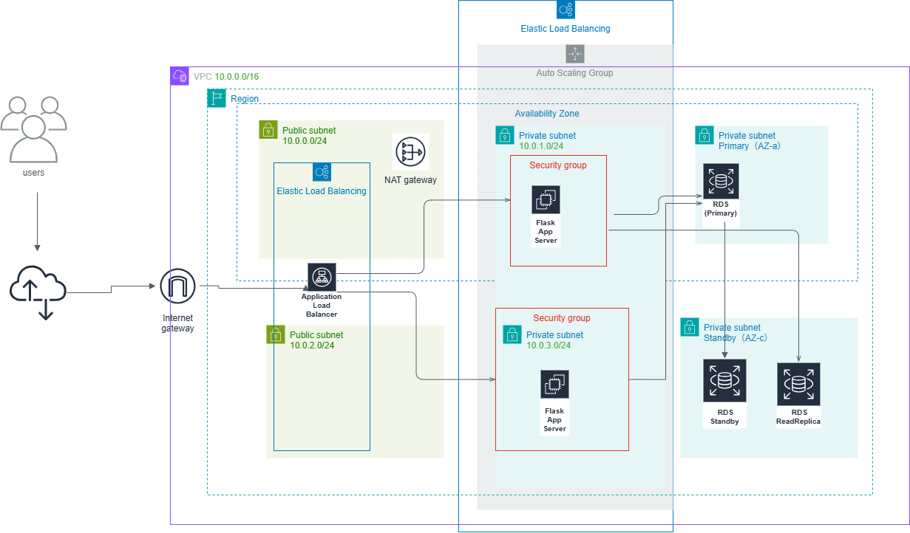

# AWS 3-Tier Architecture (Employee Search App, Multi-AZ)

本プロジェクトは、AWS 上に構築する **複数AZ対応の Web 3層アーキテクチャ** 上で Flask を用いた
**社員検索アプリケーション** を動作させる構成を Terraform によって IaC 化したものです。

本アプリケーションは、RDS（MySQL）に保存された社員情報を検索し、結果を Web UI（Flask）で表示します。

## アーキテクチャ図

  

## デプロイ手順（How to Deploy）

本プロジェクトは Terraform により AWS 上へ自動デプロイできます。

### 1. リポジトリのクローン
git clone 
https://github.com/yoshihbk/aws-3tier-terraform-multi-AZ_employee_search.git

### 2. Terraform 初期化
terraform init

### 3. 構成の確認
terraform plan

### 4. デプロイ
terraform apply

### 5. アプリケーションへアクセス
Terraform 実行後に出力される **ALB の DNS 名** にアクセスすると Flask 社員検索アプリが利用できます。

---

## 主な構成要素

### **ALB（Application Load Balancer）**
- Flask アプリへのルーティングを担当
- Target Group で EC2 × 2 のヘルスチェックを実施

### **EC2（Auto Scaling Group）**
- Flask + nginx を実行
- user_data により自動セットアップ
- systemd による Flask の自動起動

### **RDS（MySQL, Multi-AZ）**
- Primary：書き込み
- Standby：フェイルオーバー用（自動切替）  
- Multi-AZ Instanceのため、フェイルオーバーは **hostname の変化** で確認

### **VPC（Public / Private Subnets, Multi-AZ）**
- AWS ベストプラクティスに準拠したネットワーク構成

---

# 動作確認ログ（実際の検証結果）

以下は構築時に実際に取得したログであり、
**アプリケーション・DB・ALB・Multi-AZ が正常に動作していた証拠**。

---

## ✔ 1. EC2 → RDS MySQL 接続確認
mysql -h "$DB_HOST" -u "$DB_USER" -p"$DB_PASSWORD" -e "SELECT NOW();"
+---------------------+
| NOW()               |
+---------------------+
| 2026-04-27 08:05:49 |
+---------------------+

→ **EC2 から RDS へ正常接続**

mysql -h "$DB_HOST" -u "$DB_USER" -p"$DB_PASSWORD" employees -e "SELECT * FROM employees;"

+----+--------------+------------+--------------------+
| id | name         | department | email              |
+----+--------------+------------+--------------------+
|  2 | 佐藤花子     | 総務       | hanako@example.com |
|  1 | 山田太郎     | 営業       | taro@example.com   |
|  4 | 田中健       | 人事       | ken@example.com    |
|  3 | 鈴木一郎     | IT         | ichiro@example.com |
|  5 | 高橋優       | 経理       | yu@example.com     |
+----+--------------+------------+--------------------+

→ **Flask アプリが RDS のデータを正常に取得**

---

## ✔ 2. Flask（systemd）ログ

sudo journalctl -u flask -n 50 --no-pager

Apr 27 08:00:07 ip-10-0-3-180 systemd[1]: Started flask.service - Flask App.
Apr 27 08:00:07 python3[12284]: * Serving Flask app 'app'
Apr 27 08:00:07 python3[12284]: * Debug mode: off
Apr 27 08:00:07 python3[12284]: * Running on http://127.0.0.1:5000
Apr 27 08:00:07 python3[12284]: * Running on http://10.0.3.180:5000
Apr 27 08:00:34 python3[12284]: 127.0.0.1 - - "GET / HTTP/1.0" 200 -

→ **Flask が systemd で正常起動し、HTTP 200 を返している**

---

## ✔ 3. ALB → EC2 → Flask の疎通確認

※ ALB の DNS 名は Terraform apply のたびに変わるため、
  以下は構築時点の実際の値です。
curl -I http://web-alb-1279936505.ap-northeast-1.elb.amazonaws.com

HTTP/1.1 200 OK
Date: Mon, 27 Apr 2026 08:25:44 GMT
Content-Type: text/html; charset=utf-8
Content-Length: 4126
Connection: keep-alive
Server: nginx/1.28.3

→ **ALB → nginx → Flask の経路が正常**

---

## ✔ 4. Target Group のヘルスチェック

# 確認コマンド
aws elbv2 describe-target-health --target-group-arn arn:aws:elasticloadbalancing:ap-northeast-1:239998514563:targetgroup/web-tg/e8beefb7a1b627b9

# 結果
{
"TargetHealthDescriptions": [
{
"Target": {
"Id": "i-00e67b4db9d3eb652",
"Port": 80
},
"HealthCheckPort": "80",
"TargetHealth": {
"State": "healthy"
}
},
{
"Target": {
"Id": "i-01a4c01e7db8e8d7c",
"Port": 80
},
"HealthCheckPort": "80",
"TargetHealth": {
"State": "healthy"
}
}
]
}

→ **EC2 2台とも healthy**

---

# Multi-AZ フェイルオーバーについて

本環境の RDS は **Multi-AZ DB Instance（Primary + Standby の 2 ノード構成）** を採用しています。

この構成では以下の特徴があります：

- フェイルオーバー時もエンドポイントは変わらない
- インスタンス ID は変わらない
- 表示される AZ が変わらない場合もある
- **内部ホスト名（@@hostname）が切り替わることでフェイルオーバーを確認できる**

本環境では、フェイルオーバー実行後に hostname が変化したことを確認し、
**Standby が正常に Primary へ昇格することを検証済みです。**

---

# 削除（シャットダウン）手順

本環境は Terraform により構築しているため、削除も以下のコマンドで一括実行できます。

terraform destroy

これにより、Terraform 管理下のリソース（ALB・EC2・RDS・Security Group など）はすべて安全に削除されます。

---

# 学んだこと

- Multi-AZ Instance のフェイルオーバーは hostname の変化で確認する
- ALB の 200 OK が最も確実な疎通確認
- nginx + Flask + RDS の 3 層構成を安定稼働させる方法
- systemd による Flask の自動起動
- AWS の HA 構成の実践的な理解
- Terraform による再現性の高いインフラ構築

---

# まとめ
本プロジェクトでは、AWS の主要サービスを組み合わせて
高可用性・冗長性・ロードバランシングを備えた Web 3 層アーキテクチャ を構築し、
Flask アプリケーションと RDS（MySQL）が安定して連携することを確認しました。

ALB によるロードバランシング、EC2 上の Flask + nginx、RDS Multi-AZ のフェイルオーバー動作など、
本番環境に近い構成を Terraform により再現性高く構築できたことで、
AWS の HA 構成とインフラ自動化に対する理解を深めることができました。
